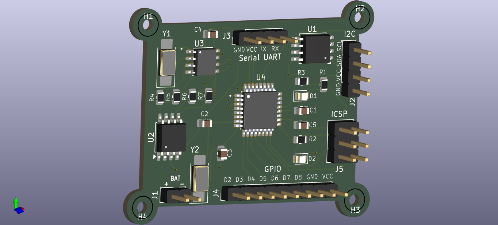
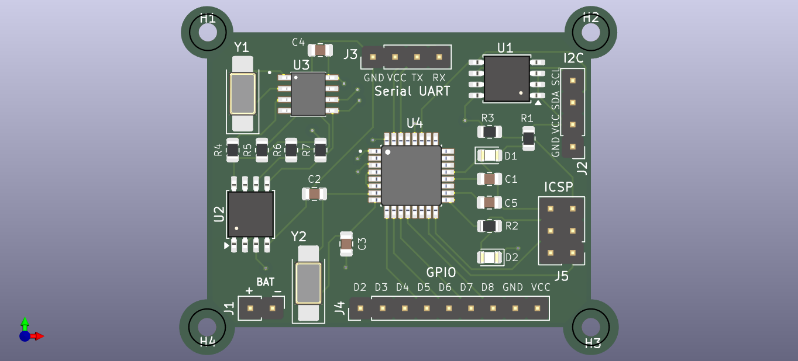

# MCU Datalogger Board

## Overview
[cite_start]This repository contains the KiCad PCB design files for a custom MCU Datalogger board[cite: 591]. This board integrates robust non-volatile memory, real-time tracking capabilities, and essential communication interfaces. It serves as a reliable hardware foundation for capturing, storing, and transmitting sensor data in embedded systems.

## Hardware Features

* [cite_start]**Microcontroller**: Powered by the ATMEGA328P-AU 8-bit AVR microcontroller [cite: 492][cite_start], running on a 16MHz external crystal[cite: 530].
* [cite_start]**Timekeeping**: Features an integrated DS1337S Real-Time Clock (RTC) [cite: 444, 446] [cite_start]equipped with a dedicated 32.768kHz crystal [cite: 455] for precise timestamping of logged data.
* **Memory & Storage**: 
    * [cite_start]Dual 24LC1025 EEPROMs (U1 and U2) [cite: 467, 555] provide extensive, reliable onboard data storage over the I2C bus.
* **User Interface & Expansion**:
    * [cite_start]Dedicated headers for standard communication protocols: I2C [cite: 617] [cite_start]and Serial UART[cite: 623].
    * [cite_start]Accessible GPIO breakout header for rapid prototyping and connecting external sensors[cite: 635].
    * [cite_start]Standard 6-pin ICSP header for direct programming and bootloader flashing[cite: 640].
    * [cite_start]Dual status LEDs (D1, D2) for easy visual debugging[cite: 501, 534].

## Visuals & Documentation

### Top View

### Board Layout & Routing

### Schematic
The complete circuit design can be viewed here: [Schematic PDF](media/schematic.pdf)